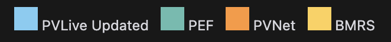

# OCF Chart Styling Guide

This repo contains code for creating charts in the general OCF format, using the OCF colour scheme and font.

For plotly, `pio.templates` is used to set the default chart styling for charts made. This is useful if you are using a notebook to create many charts and want the same base styling applied to each chart without having to rewrite the same styling code each time.

### Using The Style

1. The first way to use this is to copy and paste the code into your notebook/script where you are generating plotly charts.
2. Alternatively you can create a seperate file called setup_plotly.py with the style put into a function. Then import this function in your notebook/script using something like `from setup_plotly import setup_plotly_template`. Then running `setup_plotly_template()`.

## OCF Colours

-  `#E4E4E4`
-  `#FFD053`
-  `#FFAC5F`
-  `#FF9736`
-  `#7BCDF3`
-  `#086788`
-  `#63BCAF`
-  `#4C9A8E`
-  `#14120E`

## OCF Font

The default font to use is "Inter"

## Color Mapping

A color mapping can be useful way to keep track of what each variable each color is associated with. An example of how this might be usesd is:

```
color_mapping = {
    'PVLive Updated': colors[0],
    'PEF': colors[1],
    'PVNet': colors[2],
    'BMRS': colors[3]
}
```

The associated colors in this mapping can be printed in a notebook using

```
from IPython.display import HTML; HTML(''.join([f"<div style='display:inline-block; margin-right:10px;'><div style='width:20px; height:20px; background:{color}; display:inline-block;'></div> {model}</div>" for model, color in color_mapping.items()]))
```

which would print the following



When creating charts ``color_discrete_map=color_mapping`` can be passed when creating charts to map the colors.